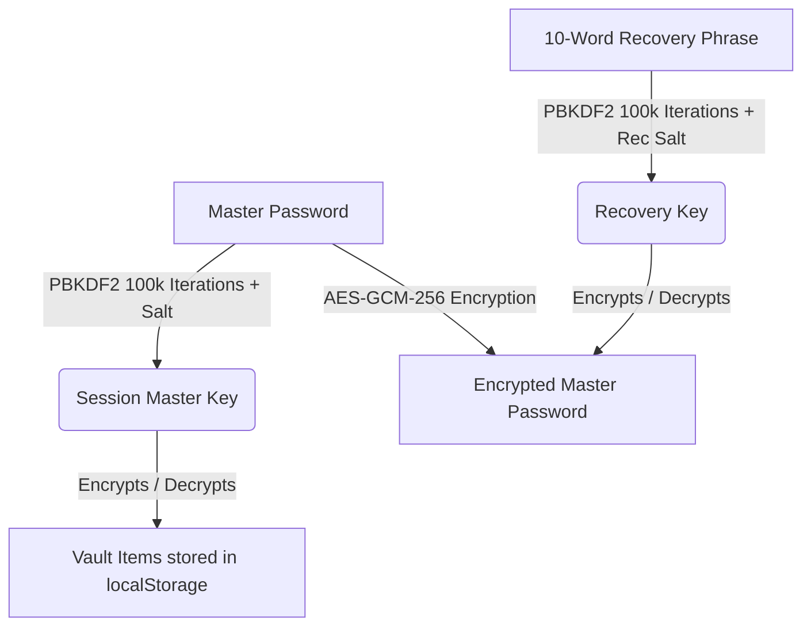

# 🔒 SecureVault

**SecureVault** is a premium, offline-first, zero-knowledge desktop password manager. Built using Electron, React, and the native Web Crypto API, it is designed to keep your credentials completely under your control—fully encrypted and stored locally on your device.

---

## 💡 The Problem with Other Password Managers

Most popular password managers (e.g., LastPass, 1Password, Bitwarden) store your encrypted database in their centralized cloud databases. While this provides convenience, it introduces critical vulnerabilities:

1. **Massive Cloud Targets**: Centralized cloud databases are prime targets for sophisticated hackers. If the database is breached (as has happened in historical LastPass leaks), hackers obtain copy backups of your encrypted vault. They can then perform offline brute-force attacks at their leisure.
2. **Third-Party Custody**: Your encrypted data is stored on servers owned by others. If a server vulnerability or configuration error exposes files, your data is compromised.
3. **Phishing and Account Takeovers**: Cloud-based recovery mechanisms (like email password resets or SMS verification) are vulnerable to phishing, SIM-swapping, and social engineering.
4. **The Zero-Recovery Trap**: Many offline or local password managers have no recovery option at all. If you forget your master password, your data is permanently gone.

---

## ✨ Why SecureVault is Better

SecureVault offers a robust alternative by returning full custody of credentials to you:

* **True Zero-Knowledge Architecture**: Your master password and decrypted credentials never touch a network card, external server, or database. Encryption and decryption occur entirely in-memory on your machine.
* **Offline-First Local Storage**: All vault records are encrypted and stored in the local application sandbox (`localStorage`), completely isolated from the internet.
* **Advanced Web Cryptography**: Powered by the native Web Crypto API:
  * Key derivation is handled by **PBKDF2** using a unique salt, **100,000 iterations**, and a **SHA-256** hash.
  * Credential records are encrypted using **AES-GCM-256** with a unique, cryptographically random **12-byte IV** for every record.
* **Fail-Safe 10-Word Recovery Phrase**: During the first-time setup, the app generates 10 random words. This phrase derives a separate recovery key (using PBKDF2) to encrypt your master password string locally. If you ever forget your master password, you can enter these 10 words to safely recover your vault and set a new password.
* **Active Defense Security Controls**:
  * **Auto-Lock on Inactivity**: Automatically locks and wipes in-memory keys after 5 minutes of idle time.
  * **Auto-Lock on Focus Loss**: Instantly locks the vault when the application window is minimized or loses active focus.
  * **Clipboard Cleanser**: Clears copied passwords from the clipboard after 15 seconds to prevent keyloggers or clipboard listeners from intercepting credentials.
  * **Offline JSON Backups**: Allows you to easily export your encrypted database as a local JSON backup file and import it on another device.

---

## 🛠️ How It Works (Technical Overview)



1. **Vault Creation**: When you register, a cryptographic salt is generated. A `Session Master Key` is derived from your Master Password using PBKDF2.
2. **Recovery Key Generation**: A 10-word phrase is generated. The words are normalized and passed through PBKDF2 with a second salt to derive a `Recovery Key`. The `Master Password` is then encrypted using this `Recovery Key` and stored locally.
3. **Data Encryption**: When you save credentials, they are converted to JSON, encrypted using AES-GCM-256 with a unique IV, and saved to the local database.
4. **Locking**: When the session locks, the `Session Master Key` and all decrypted vault data are immediately wiped from active memory.

---

## 🚀 Setting Up & Installation

### For Users
To install the pre-compiled desktop application:
1. Go to the [Releases](https://github.com/abbasdalhatu/password-manager/releases) page of this repository.
2. Download the installer for your operating system:
   - **Windows**: `SecureVault Setup 1.0.0.exe`
   - **macOS**: `SecureVault-1.0.0.dmg` or `SecureVault-1.0.0-mac.zip`
   - **Linux**: `SecureVault-1.0.0.AppImage` or `secure-vault-desktop_1.0.0_amd64.deb`
3. Run the installer to complete the setup:
   - On **Windows**: Run the `.exe` installer.
   - On **macOS**: Double-click the `.dmg` file and drag `SecureVault` to your `Applications` folder, or extract the `.zip` archive.
   - On **Linux**: 
     - For **AppImage**: Right-click the `.AppImage` file, open Properties > Permissions, check "Allow executing file as program", and run it. Alternatively, run `chmod +x SecureVault-1.0.0.AppImage && ./SecureVault-1.0.0.AppImage` in the terminal.
     - For **Debian/Ubuntu**: Install the `.deb` package using `sudo dpkg -i secure-vault-desktop_1.0.0_amd64.deb` or double-click it.
   > [!NOTE]
   > On macOS, since this application is not signed with an Apple Developer Account, you may need to right-click the application icon, select **Open**, and confirm to bypass Gatekeeper protection.

### For Developers
To run or build the application from source code:

1. **Clone the Repository**:
   ```bash
   git clone https://github.com/abbasdalhatu/password-manager.git
   cd password-manager
   ```

2. **Install Dependencies**:
   ```bash
   npm install
   ```

3. **Run in Development Mode**:
   - To run the web developer environment:
     ```bash
     npm run dev
     ```
   - To run the Electron desktop application environment:
     ```bash
     npm run electron:dev
     ```

4. **Build the Desktop Installer**:
   To bundle and package the application into installers for different platforms:
   - **Windows Installer**:
     ```bash
     npm run electron:build:win
     ```
     The generated installer will be placed in `dist_electron/SecureVault Setup 1.0.0.exe`.
   - **macOS Installer**:
     ```bash
     npm run electron:build:mac
     ```
     The generated installer/archive will be placed in `dist_electron/SecureVault-1.0.0.dmg` and `dist_electron/SecureVault-1.0.0-mac.zip`.
   - **Linux Installer**:
     ```bash
     npm run electron:build:linux
     ```
     The generated packages will be placed in `dist_electron/SecureVault-1.0.0.AppImage` and `dist_electron/secure-vault-desktop_1.0.0_amd64.deb`.
   - **All Platforms (Windows, macOS & Linux)**:
     ```bash
     npm run electron:build:all
     ```

   > [!TIP]
   > **Cross-Platform Compilation Tip**: Because macOS builds require a macOS operating system to package `.dmg` files, you cannot compile the macOS targets natively on Windows.
   > We have configured a GitHub Actions CI/CD workflow under `.github/workflows/build.yml` to solve this. Simply push a tag (e.g., `git tag v1.0.0 && git push origin v1.0.0`) or trigger the workflow manually under the **Actions** tab of your GitHub repository. It will build Windows, macOS, and Linux installers and upload them as workflow artifacts.

---

## 🛡️ The SecureVault Guarantee

We operate under a strict **Zero-Data, Zero-Access** guarantee:

* We do not host any backend servers or cloud databases.
* We cannot see, log, or recover your master password.
* We cannot access or read your recovery words.
* We cannot decrypt your database under any circumstances.

Your security is entirely in your hands. Write down your 10 recovery words, store them in a secure physical location, and enjoy absolute privacy.
